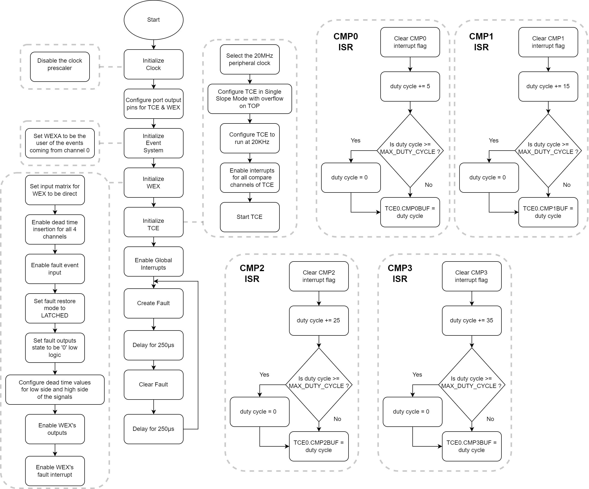
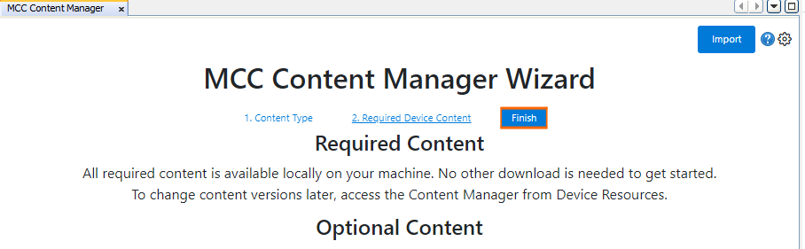
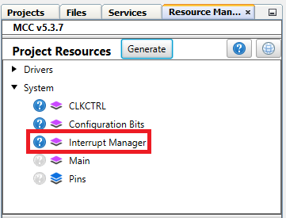
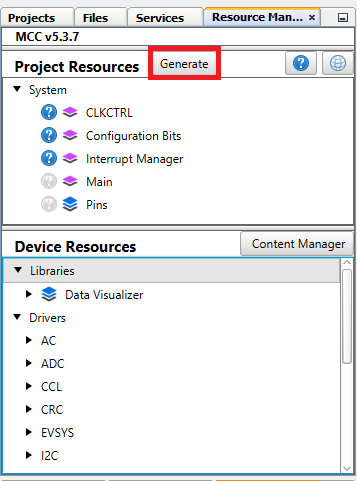

[](https://www.microchip.com)

## Generate Eight Complementary Pulse-Width Modulation Signals Using the TCE and WEX modules

Below is an example of how to set a Timer Counter Type E (TCE) and a Waveform Extension (WEX) instance to generate eight complementary Pulse-Width Modulation (PWM) signals at 20 KHz with a variable duty cycles using the buffering scheme. The signals are in pairs of two and are not overlapping due to the added dead time, a feature which is essential in Motor Control for avoiding the shoot-through current in transistor switching. The update of the Compare registers will happen during the compare match interrupts for each channel. In this example the fault is highlighted as well. When a software event is triggered all the signals are driven low. This happens every 250 μs. To do this, the WEX will be configured for fault detection and the Event System (EVSYS) will be configured to generate a software event. In this example the WEX module is used as a timer extension, not in Pattern Generation mode.

## Related Documentation

More details and code examples on the AVR16EB32 can be found at the following links:

- [AVR<sup>®</sup> EB Product Page](https://www.microchip.com/en-us/product/AVR16EB32)
- [AVR<sup>®</sup> EB Code Examples on GitHub](https://github.com/microchip-pic-avr-examples?q=AVR16EB32)

## Software Used

- [MPLAB® X IDE v6.15 or newer](https://www.microchip.com/en-us/tools-resources/develop/mplab-x-ide)
- [AVR-Ex DFP-2.8.189 or newer Device Pack](https://packs.download.microchip.com/)
- [MPLAB® XC8 compiler v2.45](https://www.microchip.com/en-us/tools-resources/develop/mplab-xc-compilers/downloads-documentation#XC8)
- [MPLAB® Code Configurator (MCC) v 5.3.7](https://www.microchip.com/en-us/tools-resources/configure/mplab-code-configurator)
- [MPLAB® Code Configurator (MCC) Melody Core v 2.6.2 or newer](https://www.microchip.com/en-us/tools-resources/configure/mplab-code-configurator)

## Hardware Used

- [AVR<sup>®</sup> EB Curiosity Nano](https://www.microchip.com/en-us/product/AVR16EB32)

## Setup

The AVR16EB32 Curiosity Nano Development Board is used as a test platform.

<br>

## Functionality

<br>After the peripheral clock, the output port pins, TCE, WEX, Event System are configured and the global interrupts are enabled, the ```Create_Fault``` and ```Clear_Fault``` functions are called in an infinite loop.
<br>The first function creates a software fault that drives all the output port pins to the low '0' logic. The WEX module's fault handling mechanism is configured in latched mode. Consequently, the fault will be cleared if the fault condition is not active anymore and a software clear command is given. The second function clears the fault and restarts the normal operation of the TCE. First the fault is triggered, then the fault is maintained using a delay of 250 μs. After that delay, the fault is cleared and the TCE works normally for another 250 μs. After that, another fault is triggered and the process repeats itself infinitely.
<br>The TCE is configured in Single-Slope mode and runs at 20 KHz. The TCE generates four PWM signals with different duty cycles that are updated in interrupt service routines (ISR). The WEX is configured to be an extension for the TCE and to generate complementary signals with dead time for the ones generated by the TCE. The WEX is also configured to handle faults and the Event System is configured to send software events to the WEX.

## Function Called in an Infinite Loop

```c
void Create_Fault(void)
{
    /* Fault creation, repeat in main loop to see it on Logic Analyzer. This is an event generated using a software command */
    EVSYS_SoftwareEventASet(EVSYS_SWEVENTA_CH0_gc);
}

void Clear_Fault(void)
{
    /* Clear fault condition using a software command */
    WEX0_SoftwareCommand(WEX_CMD_FAULTCLR_gc);
}
```

<br>

<br>To generate this project using MPLAB® X IDE and the MPLAB® X Code Configurator (MCC Melody, MCC Clasic is not supported on this device), follow the next steps:

<br>1. Open MPLAB X IDE and create a new project for AVR16EB32 device.

<br>2. Open MCC from the toolbar (more information on how to install the MCC plug-in can be found [here](https://onlinedocs.microchip.com/pr/GUID-1F7007B8-9A46-4D03-AEED-650357BA760D-en-US-6/index.html?GUID-D98198EA-93B9-45D2-9D96-C97DBCA55267)).

<br>3. In MCC Content Manager Wizard select MCC Melody then select the Finish button.<br>
<br>
<br>

<br>4. Click on Project Resources, go to System, select Interrupt Manager and toggle the Global Interrupt Enable button
<br>
<br>

<br>5. Go to Project Resources, click System then click CLKCTRL and disable the Prescaler enable button
<br>
<br>

<br>6. From the Device Resources go to Drivers and click the Timer window, add the TCE module, then do the following configuration:
<br>
  <br> - Enable Timer: Should be enabled by default, if not just toggle the button (it turns blue if enabled)
  <br> - Clock Divider: System clock (by default the divider should be 1 - System clock)
  <br> - Waveform Generation Mode: Single-slope PWM mode
  <br> - Requested Period[s]: 0.00005
  <br> - Waveform Output n : check the boxes from the Enable column for Waveform Output 0, 1, 2, 3
  <br> - Generate ISR: toggle the button (it turns blue if enabled)
  <br> - Enable Compare 0 Interrupt: toggle the button (it turns blue if enabled)
  <br> - Enable Compare 1 Interrupt: toggle the button (it turns blue if enabled)
  <br> - Enable Compare 2 Interrupt: toggle the button (it turns blue if enabled)
  <br> - Enable Compare 3 Interrupt: toggle the button (it turns blue if enabled)
<br>
<br>

<br>7. From the Device Resources click the Drivers window, add the WEX module, then do the following configuration:
<br>
  <br> - Input Matrix: Direct
  <br> - Update Source: TCE (the update condition for the output signals will be dictated by TCE)
  <br> - Override Settings: Check all the boxes from the Output Enable column for the Waveform Output [0-7]
  <br> - Dead-time Insertion Channel 0 Enable: toggle the button (it turns blue if enabled)
  <br> - Dead-time Insertion Channel 1 Enable: toggle the button (it turns blue if enabled)
  <br> - Dead-time Insertion Channel 2 Enable: toggle the button (it turns blue if enabled)
  <br> - Dead-time Insertion Channel 3 Enable: toggle the button (it turns blue if enabled)
  <br> - Requested Dead-time Low Side (μs) : 0.150
  <br> - Requested Dead-time High Side (μs) : 0.250
  <br> - Fault Event Input A : toggle the button (it turns blue if enabled)
  <br> - Fault Enable: toggle the button (it turns blue if enabled)
  <br> - Fault Interrupt Enable: toggle the button (it turns blue if enabled)
  <br> - Fault Detection Restart Mode: Cycle-by-cycle
  <br> - Fault Detection Action: Low
<br>
<br>

<br>8. From the Device Resources go to the Drivers window, add the EVSYS module, then do the following configuration:
<br>
  <br> - CHANNELS: CHANNEL0
  <br> - USERS: WEXA (from CHANNEL0 rectangle from CHANNELS tab hold and drag the cursor to the WEXA rectangle from the USERS tab)
<br>
<br>

<br>9. In the Pin Grid View window check if the WEX_WO[0-7] pins are locked as outputs on PORTA. When the boxes from Enable column from Waveform Output n are checked, the pins are also
locked. To change the PORT simply click on a pin from another PORT in Pin Grid View.

 |Pin                       | Configuration       |
 | :---------------------:  | :----------------:  |
 |            PA0           |   TCE & WEX WO0     |
 |            PA1           |   TCE & WEX WO1     |
 |            PA2           |   TCE & WEX WO2     |
 |            PA3           |   TCE & WEX WO3     |
 |            PA4           |   TCE & WEX WO4     |
 |            PA5           |   TCE & WEX WO5     |
 |            PA6           |   TCE & WEX WO6     |
 |            PA7           |   TCE & WEX WO7     |

<br>

<br>7. In the Project Resources window, click the Generate button so that MCC will generate all the specified drivers and configurations.
<br>
<br>
<br>
<br>

<br>8. After the MCC Melody generates the project files with the configuration explained above, overwrite the content from main.c file with this:

```c
/* Calculated values for TCE's period and the maximum duty cycle */
#define TCE_PERIOD            (0x3E8)
#define MAX_DUTY_CYCLE        (0x3DE)

#include "mcc_generated_files/system/system.h"
#include <util/delay.h>

/* Callback function that is called in the ISR routine */
void UserCallback_CMP0(void)
{
  static uint16_t duty_cycle = 0;

  /* Duty cycle update in interrupt */
  duty_cycle += 5;
  if(duty_cycle >= MAX_DUTY_CYCLE)
    duty_cycle = 0;
  TCE0_PWM_BufferedDutyCycle0Set(duty_cycle);
}

/* Callback function that is called in the ISR routine */
void UserCallback_CMP1(void)
{
  static uint16_t duty_cycle = 0;

  /* Duty cycle update in interrupt */
  duty_cycle += 15;
  if(duty_cycle >= MAX_DUTY_CYCLE)
    duty_cycle = 0;
  TCE0_PWM_BufferedDutyCycle1Set(duty_cycle);
}

/* Callback function that is called in the ISR routine */
void UserCallback_CMP2(void)
{
  static uint16_t duty_cycle = 0;

  /* Duty cycle update in interrupt */
  duty_cycle += 25;
  if(duty_cycle >= MAX_DUTY_CYCLE)
    duty_cycle = 0;
  TCE0_PWM_BufferedDutyCycle2Set(duty_cycle);
}

/* Callback function that is called in the ISR routine */
void UserCallback_CMP3(void)
{
  static uint16_t duty_cycle = 0;

  /* Duty cycle update in interrupt */
  duty_cycle += 35;
  if(duty_cycle >= MAX_DUTY_CYCLE)
    duty_cycle = 0;
  TCE0_PWM_BufferedDutyCycle3Set(duty_cycle);
}

void Create_Fault(void)
{
  /* Fault creation, repeat in main loop to see it on Logic Analyzer. This is an event generated using a software command */
  EVSYS_SoftwareEventASet(EVSYS_SWEVENTA_CH0_gc);
}

void Clear_Fault(void)
{
  /* Clear fault condition using a software command */
  WEX0_SoftwareCommand(WEX_CMD_FAULTCLR_gc);
}

int main(void)
{
  SYSTEM_Initialize();

  TCE0_Compare0CallbackRegister(UserCallback_CMP0);
  TCE0_Compare1CallbackRegister(UserCallback_CMP1);
  TCE0_Compare2CallbackRegister(UserCallback_CMP2);
  TCE0_Compare3CallbackRegister(UserCallback_CMP3);

  while(1)
  {
    Create_Fault();
    _delay_us(250);
    Clear_Fault();
    _delay_us(250);
  }    
}
```

<br>9. Now the project can be built and run from MPLAB X IDE. At run time, the values for the compare registers modifiy at interrupts generated for each channel. A software fault is generated and cleared periodically, resuming normal operation.

## Operation

 1. Connect the board to the PC.

 2. Open the **TCE_AND_WEX_8_Complementary_PWM_MCC.X** or **TCE_AND_WEX_8_Complementary_PWM.X** solution in MPLAB X IDE.

 3. Right click on the project and select **Set as main project**.

<br>

 4. Build the **TCE_AND_WEX_8_Complementary_PWM_MCC.X** or **TCE_AND_WEX_8_Complementary_PWM.X** project: click on **Clean and Build Project**.

<br>

 5. Program the project to the board: click on **Make and Program Device**.

<br>

## Results

Below is illustrated a logic analyzer capture, to help understanding a little bit better how the WEX generates a complementary waveform signal for each PWM signal generated by TCE and how does the fault handling work in hardware:

<br>The range of the duty cycles is 0-50% of the PERIOD 
<br>

## Summary

This project shows how to use the WEX and TCE to generate complementary PWM signals and how to use the fault feature of WEX. Using TCE and WEX can generate up to 8 PWM signals complementary in 4 independent pairs.