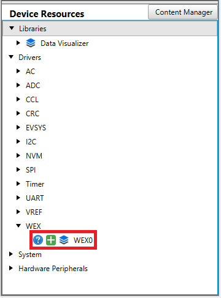

[](https://www.microchip.com)

## Generate Patterns Using WEX

A basic use case of the timer’s waveform extension is to set a pattern for the output signals that changes periodically. The program will toggle the pins (complementary pattern) every 25 μs using software delay for ten times. After another 250 μs a stair-like pattern will be generated, with 5 μs delay between each step. After another 250 μs delay, the process repeats.

## Related Documentation

- [AVR<sup>®</sup> EB Product Page](https://www.microchip.com/en-us/product/AVR16EB32)
- [AVR<sup>®</sup> EB Code Examples on GitHub](https://github.com/microchip-pic-avr-examples?q=AVR16EB32)

## Software Used

- [MPLAB® X IDE v6.15 or newer](https://www.microchip.com/en-us/tools-resources/develop/mplab-x-ide)
- [AVR-Ex DFP-2.8.189 or newer Device Pack](https://packs.download.microchip.com/)
- [MPLAB® XC8 compiler v2.45](https://www.microchip.com/en-us/tools-resources/develop/mplab-xc-compilers/downloads-documentation#XC8)
- [MPLAB® Code Configurator (MCC) v5.3.7](https://www.microchip.com/en-us/tools-resources/configure/mplab-code-configurator)
- [MPLAB® Code Configurator (MCC) Melody Core v2.6.2 or newer](https://www.microchip.com/en-us/tools-resources/configure/mplab-code-configurator)

## Hardware Used

- [AVR<sup>®</sup> EB Curiosity Nano](https://www.microchip.com/en-us/product/AVR16EB32)

## Setup

The AVR16EB32 Curiosity Nano Development Board is used as a test platform.

<br>

## Functionality

After the output port pins of the Waveform Extension (WEX) are configured, WEX is initialized, Timer Counter type E (TCE) is started, the ```Complementary_Pattern_Set``` and ```Stairs_Pattern_Set``` functions are called in an infinite loop. These functions change the output port pins state by overriding the current state with a new one. The update condition is done in software using delays. The WEX is configured in Pattern Generation Mode to be able to override the port pins outputs. The first function is used to generate a complementary pattern of 0 and 1 for the eight output signals of WEX. After a 250 μs delay the second function is called and a stairs pattern is generated. After another 250 μs delay the process repeats in an infinite loop.

## Functions Called in an Infinite Loop

```c
void Complementary_Pattern_Set(void)
{
    WEX0_PatternGenerationOutputSet(COMPLEMENTARY_PATTERN);
    uint8_t complementary_pattern = COMPLEMENTARY_PATTERN;
    _delay_us(25);

    /* Complementary signals pattern */
    for(uint8_t i = 0; i < 9; i++)
    {
        /* Complementary_pattern variable changes at every step */
        complementary_pattern = ~complementary_pattern;

        /* Toggle the pattern for each of the WEX's output */
        WEX0_PatternGenerationOutputSet(complementary_pattern);

        /* Software delay added in order for the toggle to be visible */
        _delay_us(25);
    }
    
    /* Put all signals in low '0' logic and wait 250us to see the transition from one of the
     * complementary patterns to the stairs pattern*/
    WEX0_PatternGenerationOutputSet(PATTERN_RESET);
}

void Stairs_Pattern_Set(void)
{
    /* Each of the signals switch from low to high one at a time in increasing order
     * generate a stairs increment pattern*/
    WEX0_PatternGenerationOutputSet(STAIRCASE7_PATTERN);

    /* Software delay added in order for the increment to be visible */
    _delay_us(5);
    WEX0_PatternGenerationOutputSet(STAIRCASE6_PATTERN);
    _delay_us(5);
    WEX0_PatternGenerationOutputSet(STAIRCASE5_PATTERN);
    _delay_us(5);
    WEX0_PatternGenerationOutputSet(STAIRCASE4_PATTERN);
    _delay_us(5);
    WEX0_PatternGenerationOutputSet(STAIRCASE3_PATTERN);
    _delay_us(5);
    WEX0_PatternGenerationOutputSet(STAIRCASE2_PATTERN);
    _delay_us(5);
    WEX0_PatternGenerationOutputSet(STAIRCASE1_PATTERN);
    _delay_us(5);
    
    /* Each of the signals switch from low to high one at a time in decreasing order
     * generate a stairs decrement pattern*/
    WEX0_PatternGenerationOutputSet(STAIRCASE0_PATTERN);

    /* Software delay added in order for the decrement to be visible */
    _delay_us(5);
    WEX0_PatternGenerationOutputSet(STAIRCASE1_PATTERN);
    _delay_us(5);
    WEX0_PatternGenerationOutputSet(STAIRCASE2_PATTERN);
    _delay_us(5);
    WEX0_PatternGenerationOutputSet(STAIRCASE3_PATTERN);
    _delay_us(5);
    WEX0_PatternGenerationOutputSet(STAIRCASE4_PATTERN);
    _delay_us(5);
    WEX0_PatternGenerationOutputSet(STAIRCASE5_PATTERN);
    _delay_us(5);
    WEX0_PatternGenerationOutputSet(STAIRCASE6_PATTERN);
    _delay_us(5);
    WEX0_PatternGenerationOutputSet(STAIRCASE7_PATTERN);
    _delay_us(5);
    
    /* Put all signals in low '0' logic and wait 250us to see the transition from the
     * stairs pattern to one of the complementary patterns */
    WEX0_PatternGenerationOutputSet(PATTERN_RESET);
}
```

<br>

<br>To generate this project using MPLAB X IDE and the MPLAB X Code Configurator (MCC Melody, MCC Clasic is not supported on this device), follow the next steps:

<br>1. Open MPLAB X IDE and create a new project for the AVR16EB32 device.

<br>2. Open MCC from the toolbar (more information on how to install the MCC plug-in can be found [here](https://onlinedocs.microchip.com/pr/GUID-1F7007B8-9A46-4D03-AEED-650357BA760D-en-US-6/index.html?GUID-D98198EA-93B9-45D2-9D96-C97DBCA55267)).

<br>3. In **MCC Content Manager Wizard** select **MCC Melody** then select the **Finish**.<br>
<br>
<br>

<br>4. To add the TCE module, go to _Device Resources>Drivers>Timer>TCE0_, then do the following configuration:
<br>
    <br> - Module Enable - toggle the button (it turns blue if enabled)
<br>

<br>5. To add the WEX module, go to _Device Resources>Drivers>WEX>WEX0_, then do the following configuration:
<br>
    <br> - Input Matrix: Direct
    <br> - Update Source: TCE (the update condition for the output signals will be the TCE module)
    <br> - Override Settings: Check all the boxes from the Output Enable column for the Waveform Output [0-7]
    <br> - Pattern Generation Mode Enable: Toggle the button (it turns blue if enabled)
    <br> - Pattern Generation Actions: Check all the boxes from the Override Enable column and set a desired state (LOW or HIGH) for each output, to set a pattern
<br>

<br>6. In the **Pin Grid View** tab check if the WEX WO [0-7] pins are locked as outputs on PORTA. When the boxes from Output Enable column from Override Settings are checked, the pins are
also locked. To change the PORT simply click a pin from another PORT in **Pin Grid View**.

 |Pin                       | Configuration       |
 | :---------------------:  | :----------------:  |
 |            PA0           |   WEX WO0           |
 |            PA1           |   WEX WO1           |
 |            PA2           |   WEX WO2           |
 |            PA3           |   WEX WO3           |
 |            PA4           |   WEX WO4           |
 |            PA5           |   WEX WO5           |
 |            PA6           |   WEX WO6           |
 |            PA7           |   WEX WO7           |

<br>

<br>7. In the **Project Resources** tab, click the **Generate** button so that MCC will generate all the specified drivers and configurations.
<br>
<br>
<br>
<br>

<br>8. After MCC Melody generates the project files with the configuration explained above, overwrite the content from the ```main.c``` file with this:

```c
/* Patterns that are written in the PGMOUT register */
#define COMPLEMENTARY_PATTERN           (WEX_PGMOUT6_bm | WEX_PGMOUT4_bm | WEX_PGMOUT2_bm | WEX_PGMOUT0_bm)
#define STAIRCASE0_PATTERN              (WEX_PGMOUT0_bm)
#define STAIRCASE1_PATTERN              (WEX_PGMOUT1_bm)
#define STAIRCASE2_PATTERN              (WEX_PGMOUT2_bm)
#define STAIRCASE3_PATTERN              (WEX_PGMOUT3_bm)
#define STAIRCASE4_PATTERN              (WEX_PGMOUT4_bm)
#define STAIRCASE5_PATTERN              (WEX_PGMOUT5_bm)
#define STAIRCASE6_PATTERN              (WEX_PGMOUT6_bm)
#define STAIRCASE7_PATTERN              (WEX_PGMOUT7_bm)
#define PATTERN_RESET                   (0x00)

#include "mcc_generated_files/system/system.h"
#include <util/delay.h>

void Complementary_Pattern_Set(void)
{
    WEX0_PatternGenerationOutputSet(COMPLEMENTARY_PATTERN);
    uint8_t complementary_pattern = COMPLEMENTARY_PATTERN;
    _delay_us(25);

    /* Complementary signals pattern */
    for(uint8_t i = 0; i < 9; i++)
    {
        /* Complementary_pattern variable changes at every step */
        complementary_pattern = ~complementary_pattern;

        /* Toggle the pattern for each of the WEX's output */
        WEX0_PatternGenerationOutputSet(complementary_pattern);

        /* Software delay added in order for the toggle to be visible */
        _delay_us(25);
    }
    
    /* Put all signals in low '0' logic and wait 250us to see the transition from one of the
     * complementary patterns to the stairs pattern*/
    WEX0_PatternGenerationOutputSet(PATTERN_RESET);
}

void Stairs_Pattern_Set(void)
{
    /* Each of the signals switch from low to high one at a time in increasing order
     * generate a stairs increment pattern*/
    WEX0_PatternGenerationOutputSet(STAIRCASE7_PATTERN);

    /* Software delay added in order for the increment to be visible */
    _delay_us(5);
    WEX0_PatternGenerationOutputSet(STAIRCASE6_PATTERN);
    _delay_us(5);
    WEX0_PatternGenerationOutputSet(STAIRCASE5_PATTERN);
    _delay_us(5);
    WEX0_PatternGenerationOutputSet(STAIRCASE4_PATTERN);
    _delay_us(5);
    WEX0_PatternGenerationOutputSet(STAIRCASE3_PATTERN);
    _delay_us(5);
    WEX0_PatternGenerationOutputSet(STAIRCASE2_PATTERN);
    _delay_us(5);
    WEX0_PatternGenerationOutputSet(STAIRCASE1_PATTERN);
    _delay_us(5);
    
    /* Each of the signals switch from low to high one at a time in decreasing order
     * generate a stairs decrement pattern*/
    WEX0_PatternGenerationOutputSet(STAIRCASE0_PATTERN);

    /* Software delay added in order for the decrement to be visible */
    _delay_us(5);
    WEX0_PatternGenerationOutputSet(STAIRCASE1_PATTERN);
    _delay_us(5);
    WEX0_PatternGenerationOutputSet(STAIRCASE2_PATTERN);
    _delay_us(5);
    WEX0_PatternGenerationOutputSet(STAIRCASE3_PATTERN);
    _delay_us(5);
    WEX0_PatternGenerationOutputSet(STAIRCASE4_PATTERN);
    _delay_us(5);
    WEX0_PatternGenerationOutputSet(STAIRCASE5_PATTERN);
    _delay_us(5);
    WEX0_PatternGenerationOutputSet(STAIRCASE6_PATTERN);
    _delay_us(5);
    WEX0_PatternGenerationOutputSet(STAIRCASE7_PATTERN);
    _delay_us(5);
    
    /* Put all signals in low '0' logic and wait 250us to see the transition from the
     * stairs pattern to one of the complementary patterns */
    WEX0_PatternGenerationOutputSet(PATTERN_RESET);
}

int main(void)
{
    SYSTEM_Initialize();


    while(1)
    {
        Complementary_Pattern_Set();
        _delay_us(250);
        Stairs_Pattern_Set();
        _delay_us(250);
    }    
}
```

<br>9. Now the project can be built and run from MPLAB X IDE. At run time, a Complementary Pattern and a Stairs Pattern will switch between each other at every 250 μs.

## Operation

 1. Connect the board to the PC.

 2. Open the ```WEX_PGM_8Channels_Patterns_MCC.X``` solution in MPLAB X IDE.

 3. Right click the project and select Set as main project.

<br>

 4. Build the ```WEX_PGM_8Channels_Patterns_MCC.X``` project: click on **Clean and Build Project**.

<br>

 5. Click **Make and Program Device** to program the project to the board.

<br>

## Results

 The figure below illustrates a logic analyzer capture, to help understanding a little bit better how to override the port pins and take the pins control from TCE using the WEX module:

<br>Switching from an alternating `1`, `0` logic pattern to a staircase patern, using all the possible outputs.

<br>

## Summary

This project shows how to use the WEX to generate different patterns and take control of the TCE pins during run time, without stopping the timer. This is extremely useful for applications such as the trapezoidal motor control, where some Pulse-Width Modulation (PWM) signals must be forced to low `0` logic depending on the commutation sector.